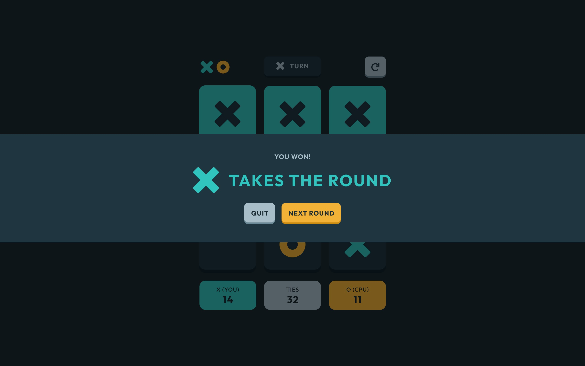

# Frontend Mentor - Tic Tac Toe solution

This is a solution to the [Tic Tac Toe challenge on Frontend Mentor](https://www.frontendmentor.io/challenges/tic-tac-toe-game-Re7ZF_E2v).

## Table of contents

- [Frontend Mentor - Tic Tac Toe solution](#frontend-mentor---tic-tac-toe-solution)
  - [Table of contents](#table-of-contents)
  - [Overview](#overview)
    - [The challenge](#the-challenge)
    - [Screenshot](#screenshot)
    - [Links](#links)
  - [My process](#my-process)
    - [Built with](#built-with)
    - [What I learned](#what-i-learned)
    - [Continued development](#continued-development)
    - [Useful resources](#useful-resources)
  - [Author](#author)

## Overview

Tic Tac Toe is a simple game in which two players alternately put Xs and Os in compartments of a figure formed by two vertical lines crossing two horizontal lines and each tries to get a row of three Xs or three Os before the opponent does.

What unique about this project is you have two options whether to play vs CPU or another player which makes the game here is more interesting (the cpu part still in the production stage)

### The challenge

Users should be able to:

-   View the optimal layout for the site depending on their device's screen size
-   See hover states for all interactive elements on the page
-   play Tic Tac Toe

### Screenshot





### Links

-   Live Site URL: [Add live site URL here](https://your-live-site-url.com)

## My process

### Built with

-   Semantic HTML5 markup
-   CSS custom properties
-   Flexbox
-   CSS Grid
-   Mobile-first workflow
-   A11y & aria Standards
-   BEM
-   Sass
-   [Gsap](https://greensock.com/gsap/) - JS animation library
-   [React](https://reactjs.org/) - JS library

### What I learned

This project was built in order to experiment with creating a complete website using the basics of React in order to increase experience and skill in dealing with React components & state

-   a focus class that gave any element have it a uniq focus stage Using the same colors as the element proportional to its size

```css
:focus {
    outline: 2px solid transparent;
}
.focus {
    --focus-shadow: 0 0 0 transparent;
    --accent-clr: var(--txt-clr);
    box-shadow: var(--focus-shadow), 0 0 0 -0.4em var(--bg-clr), 0 0 0 -0.6em
            var(--accent-clr);
    transition: box-shadow 400ms cubic-bezier(0.66, -0.2, 0.27, 1.15);
}
.focus:focus-visible {
    outline: 2px solid transparent;
    box-shadow: var(--focus-shadow), 0 0 0 0.25em var(--bg-clr), 0 0 0 0.45em
            var(--accent-clr);
}
```

-   the accent class that gave any element that have it the right variable colors

```css
.accent-X-clr {
    --accent-clr: var(--accent-X-clr);
    --accent-shadow-clr: var(--clr-teal-blue-500);
}
.accent-O-clr {
    --accent-clr: var(--accent-O-clr);
    --accent-shadow-clr: var(--clr-gold-orange-600);
}
```

-   using isolation: isolate

```css
li {
    // ! isolation: isolate is cool
    isolation: isolate;
}
```

-   using svh unite

```css
@supports (height: 100svh) {
    #root {
        height: 100svh; //? svh -> Small view height
    }
}
```

-   using the right color name for easy identification

```css
:root {
    // * ### teal blue ###
    --clr-teal-blue-500: hsl(178, 75%, 65%); // * X button shadow
    --clr-teal-blue-700: hsl(178, 60%, 48%); // * X accent color (button, text)
}
```

-   using :where

```css
:where(h1, h2, h3, h4, p, a:not(.Button), .Button, span) {
    margin: 0;
    text-transform: uppercase;
    letter-spacing: #{toRem(2px)};
    color: var(--txt-clr);
}
```

-   the js crypto API to get a random Id

```js
crypto.randomUUID();
```

-   the itemInfoFun function => a function that can handle any number of items and give each item [id, all the state =>(is played, player, is wining), location=>(index, row, column)]

```js
function itemInfoFun(dimensions) {
    let Dimensions = dimensionsFun(dimensions);
    let arr = [];

    for (let i = 0; i < dimensions; i++) {
        arr.push({});
    }
    class ItemInfo {
        constructor(id, played, player, wining, index, x, y) {
            this.id = id;
            this.played = played;
            this.player = player;
            this.location = {
                index: index,
                x: x,
                y: y,
            };
            this.wining = wining;
        }
    }

    arr.forEach((ele, i) => {
        ele.ItemInfo = new ItemInfo(crypto.randomUUID(), false, null, false, i);
    });

    for (let i = 0; i < Dimensions; i++) {
        let item = i;
        let X = 1;
        for (item; item < dimensions; item = item + Dimensions) {
            arr[item].ItemInfo.location.x = X++;
        }
    }

    for (let i = 0; i < Dimensions; i++) {
        let item = i;
        for (item; item < dimensions; item = item + Dimensions) {
            arr[item].ItemInfo.location.y = i + 1;
        }
    }

    return arr;
}
```

-   the winingSystem function => a function that can determine if one of the player wins in all horizontal, vertical or diagonal cases, and it can also work with any size, whether 3 \* 3 or more

```js
//! if winingSystem return true => O wines, false => X wines, null => draw
//! winingSystem change the wining items state by itself
function winingSystem() {
    // for diagonals
    let diagonals = [[], []];
    // * diagonals[0] for the first diagonal diagonals[1] for the second diagonal
    for (let i = 0; i < dimensions; i++) {
        if (
            gameItems[i].ItemInfo.location.x +
                gameItems[i].ItemInfo.location.y ==
                Dim + 1 ||
            gameItems[i].ItemInfo.location.x -
                gameItems[i].ItemInfo.location.y ==
                0
        ) {
            if (
                gameItems[i].ItemInfo.location.x ==
                gameItems[i].ItemInfo.location.y
            ) {
                diagonals[0].push(gameItems[i]);
                if (diagonals[0].length == Dim) {
                    if (
                        diagonals[0].every(
                            (ele) => ele.ItemInfo.player == false
                        )
                    ) {
                        // if x wins
                        xWins(diagonals[0]);
                    }
                    if (
                        diagonals[0].every((ele) => ele.ItemInfo.player == true)
                    ) {
                        // if o wins
                        oWins(diagonals[0]);
                    }
                }
            }
            if (
                gameItems[i].ItemInfo.location.x !=
                    gameItems[i].ItemInfo.location.y ||
                gameItems[i].ItemInfo.location.x +
                    gameItems[i].ItemInfo.location.y ==
                    Dim + 1
            ) {
                diagonals[1].push(gameItems[i]);
                if (diagonals[1].length == Dim) {
                    if (
                        diagonals[1].every(
                            (ele) => ele.ItemInfo.player == false
                        )
                    ) {
                        // if x wins
                        xWins(diagonals[1]);
                    }
                    if (
                        diagonals[1].every((ele) => ele.ItemInfo.player == true)
                    ) {
                        // if o wins
                        oWins(diagonals[1]);
                    }
                }
            }
        }
    }

    // for column
    for (let i = 0; i < Dim; i++) {
        let item = i;
        let winnerColX = [];
        let winnerColO = [];

        for (item; item < dimensions; item = item + Dim) {
            if (gameItems[item].ItemInfo.player == false) {
                // if X wins in a column
                winnerColX.push(gameItems[item]);
                if (winnerColX.length == Dim) {
                    xWins(winnerColX);
                }
            }
            if (gameItems[item].ItemInfo.player == true) {
                // if O wins in a column
                winnerColO.push(gameItems[item]);
                if (winnerColO.length == Dim) {
                    oWins(winnerColO);
                }
            }
        }
    }

    // for rows
    for (let i = 0; i < dimensions; i = i + 3) {
        let start = i;
        let end = i + Dim;
        let winnerRowX = [];
        let winnerRowO = [];
        for (start; start < end; start++) {
            if (gameItems[start].ItemInfo.player == false) {
                // if X wins in a row
                winnerRowX.push(gameItems[start]);
                if (winnerRowX.length == Dim) {
                    xWins(winnerRowX);
                }
            }
            if (gameItems[start].ItemInfo.player == true) {
                // if O wins in a row
                winnerRowO.push(gameItems[start]);
                if (winnerRowO.length == Dim) {
                    oWins(winnerRowO);
                }
            }
        }
    }

    // if draw
    let d = gameItems.every((item) => {
        return item.ItemInfo.played == true && item.ItemInfo.wining == false;
    });
    if (d) {
        draw();
    }
}
```

-   if css aspect-ratio dose note work the hight of the element will be calculated using JS

```jsx
useEffect(() => {
    if (!CSS.supports("aspect-ratio: 1 / 1")) {
        let gameBoardItem = document.querySelector(
            ".Stage2 main#Game > div:has(button)"
        );
        setPgWidth(gameBoardItem.offsetWidth);
        window.onresize = () => {
            setPgWidth(gameBoardItem.offsetWidth);
            gameBoardItem.style.height = pgWidth;
        };
    }
}, [window.innerWidth]);
```

-   the idea of using on single useStage object for the entire project

```jsx
const [pageStates, setPageStates] = useState({
    pageState: 1,
    gameResult: {
        restart: false,
        draw: false,
        winner: null,
        history: {
            xWins: 0,
            oWins: 0,
            draw: 0,
        },
    },
    players: {
        cpu: {
            playingWith: false,
            cpuPlayer: null,
        },
        p1: false,
        currentPlayer: false,
    },
});
```

-   making an svg React component To get different state of the same element

```jsx
function OIcon(prop) {
    let stroke;
    prop.hover ? (stroke = 2) : (stroke = 0);

    return (
        <svg
            width={64 + stroke}
            height={64 + stroke}
            viewBox={`0 0 ${64 + stroke} ${64 + stroke}`}
            xmlns="http://www.w3.org/2000/svg"
            className={`${accentFun(prop.accent)} O-icon`}
        >
            <title>O icon</title>
            <path
                d={
                    prop.hover
                        ? "M33 1c17.673 0 32 14.327 32 32 0 17.673-14.327 32-32 32C15.327 65 1 50.673 1 33 1 15.327 15.327 1 33 1Zm0 18.963c-7.2 0-13.037 5.837-13.037 13.037 0 7.2 5.837 13.037 13.037 13.037 7.2 0 13.037-5.837 13.037-13.037 0-7.2-5.837-13.037-13.037-13.037Z"
                        : "M32 0c17.673 0 32 14.327 32 32 0 17.673-14.327 32-32 32C14.327 64 0 49.673 0 32 0 14.327 14.327 0 32 0Zm0 18.963c-7.2 0-13.037 5.837-13.037 13.037 0 7.2 5.837 13.037 13.037 13.037 7.2 0 13.037-5.837 13.037-13.037 0-7.2-5.837-13.037-13.037-13.037Z"
                }
                fill={prop.hover ? "none" : "var(--accent-clr)"}
                stroke={prop.hover ? "var(--accent-clr)" : "none"}
                strokeWidth={stroke}
                fillRule={
                    (!prop.hover && prop.accent == "x") || prop.accent == "o"
                        ? "evenodd"
                        : "nonzero"
                }
            />
        </svg>
    );
}
```

### Continued development

-   React components & state
-   Gsap filp
-   static website & dynamic website

### Useful resources

Check out my latest previous articles:

-   [Top 5 websites to sharpen your front-end skills.](https://dev.to/ymhaah/top-5-websites-to-sharpen-your-front-end-skills-3ao0)
-   [Why couldn't you get a job as a freelancer?](https://dev.to/ymhaah/why-couldnt-you-get-a-job-as-a-freelancer-1jm8)
-   [Top 5 Icon websites for devs and designers!!!](https://dev.to/ymhaah/top-5-icon-websites-for-devs-and-designers-53mh)
-   [30-Day React Learning Journey!](https://dev.to/ymhaah/series/20473)

## Author

-   professional links:
    -   [Twitter](https://twitter.com/hafanwi)
    -   [LinkedIn](https://www.linkedin.com/in/youssef-hafnawy/)
    -   [GitHub](https://github.com/ymhaah)
-   Hire me:
    -   [UpWork](https://www.upwork.com/services/product/development-it-a-custom-and-responsive-websites-in-wordpress-1577236892828233728?ref=project_share)
    -   [Freelancer](https://freelancer.com/u/ymhaah)
-   Blog:
    -   [HashNode](https://hafnawi.hashnode.dev/)
    -   [Dev.to](https://dev.to/ymhaah)
    -   [Medium](https://medium.com/@ymhaah250)
